# Architectural Design Note: ArchJudge Platform

## 1. System Overview & User Flow

ArchJudge is a lightweight, high-performance monolith designed to provide instant, criterion-based feedback on Low-Level Design (LLD) submissions.

```mermaid
sequenceDiagram
    autonumber
    actor Learner
    participant UI as React Frontend
    participant Server as Express API
    participant Queue as Async EvaluationQueue
    participant Composite as CompositeEvaluator
    participant Det as DeterministicEvaluator
    participant LLM as LLMEvaluator
    participant Repos as Repositories (In-Memory/DB)

    Learner->>UI: Selects Problem & edits Design / Relationships / Rationale
    UI->>Server: POST /api/attempts (problemId, rawContent, prevAttemptId)
    Server->>Repos: Save Attempt (Status: Submitted)
    Server->>Queue: Enqueue Attempt ID
    Server-->>UI: Return Attempt (201 Created)
    UI-->>Learner: Display "Evaluating..." non-blocking status screen

    rect rgb(30, 41, 59)
        Note over Queue,Composite: Asynchronous Background Worker
        Queue->>Repos: Update Attempt status -> "Evaluating"
        Queue->>Composite: evaluate(parsedSubmission, problem)
        Composite->>Det: evaluate() [Fast structural checks]
        Det-->>Composite: DeterministicResult (SRP, smell detection, evidence)
        Composite->>LLM: evaluate() [Semantic judgment + retry timeout wrapper]
        alt LLM Succeeds
            LLM-->>Composite: Qualitative Rubric Result
            Composite->>Composite: Merge & calculate weighted overall score
        else LLM Fails / Times Out
            Composite-->>Composite: Graceful fallback (isPartial = true)
        end
        Composite-->>Queue: Final EvaluationResult
        Queue->>Repos: Save EvaluationResult & update Attempt -> "Evaluated"
    end

    loop Polling every 600ms
        UI->>Server: GET /api/attempts/:id
        Server-->>UI: Return Attempt + EvaluationResult
    end
    UI-->>Learner: Render comprehensive feedback, evidence badges, & score ring
```



---

## 2. Core Domain Model

```
+-------------------------------------------------------------+
|                           Problem                           |
+-------------------------------------------------------------+
| - id: string                                                |
| - title: string                                             |
| - shortDescription: string                                  |
| - requirementsMarkdown: string                              |
| - constraints: string[]                                     |
| - difficulty: 'Easy' | 'Medium' | 'Hard'                    |
| - tags: string[]                                            |
| - extensibilityPrompt: string                               |
| - starterTemplate: string                                   |
+-------------------------------------------------------------+
                              |
                              | 1..* has attempts
                              v
+-------------------------------------------------------------+
|                           Attempt                           |
+-------------------------------------------------------------+
| - id: string                                                |
| - problemId: string                                         |
| - learnerId: string                                         |
| - status: 'Draft'|'Submitted'|'Evaluating'|'Evaluated'|'Fail'|
| - rawContent: string                                        |
| - submission?: Submission                                   |
| - resultId?: string                                         |
| - previousAttemptId?: string (supports iterative delta)     |
| - createdAt: string                                         |
| - evaluatedAt?: string                                      |
+-------------------------------------------------------------+
           |                                     |
           | aggregates                          | 1..1 produces
           v                                     v
+-----------------------+              +----------------------+
|      Submission       |              |   EvaluationResult   |
+-----------------------+              +----------------------+
| - designBlocks: []    |              | - overallScore: 0..100|
| - relationships: []   |              | - overallSummary: str|
| - rationaleText: str  |              | - criteria: []       |
| - parseErrors: []     |              | - isPartial: boolean |
+-----------------------+              | - engineVersion: str |
                                       +----------------------+
                                                 |
                                                 | 1..* contains
                                                 v
                                       +----------------------+
                                       |    CriterionScore    |
                                       +----------------------+
                                       | - criterionId: str   |
                                       | - score: 0..5        |
                                       | - explanation: str   |
                                       | - evidenceRefs: []   |
                                       | - strengths: []      |
                                       | - improvements: []   |
                                       +----------------------+
```

---

## 3. Object-Oriented Patterns Employed in Platform Implementation

### A. Strategy Pattern (`IEvaluator`)
- **Intent**: Define a family of evaluation algorithms, encapsulate each one, and make them interchangeable.
- **Application**:
  - `DeterministicEvaluator`: Runs fast regular-expression and AST structural checks.
  - `LLMEvaluator`: Evaluates semantic depth and answers to the extensibility prompt.
  - Extensibility Seam: If the platform later introduces unit test execution or UML diagram vector analysis, a new `TestRunnerEvaluator` or `DiagramEvaluator` can be plugged in without modifying `AttemptController`, `EvaluationQueue`, or the UI.

### B. Template Method Pattern (`CompositeEvaluator`)
- **Intent**: Define the skeleton of an algorithm in an operation, deferring certain steps to subclasses or helper strategies.
- **Application**:
  - `CompositeEvaluator.evaluate()` defines the fixed evaluation lifecycle:
    1. Run deterministic checks first.
    2. Run LLM pass with timeout guard and backoff retries.
    3. If LLM fails, return partial results immediately (`isPartial: true`).
    4. If LLM succeeds, merge criteria and calculate the weighted rubric score.

### C. Repository Pattern (`IProblemRepository`, `IAttemptRepository`, `IEvaluationRepository`)
- **Intent**: Decouple domain entities and business logic from the underlying data access layer.
- **Application**:
  - The current prototype runs an in-memory repository with zero installation hurdles.
  - Replacing the in-memory maps with Prisma, Drizzle, or raw SQLite/PostgreSQL requires only writing a class implementing the respective interface—no domain logic changes.

---

## 4. Key Architectural Trade-offs & Decisions

| Decision | Alternative Considered | Rationale for Choice |
| :--- | :--- | :--- |
| **Structured Markdown over Sandbox Execution** | Docker container executing user unit tests (Judge0) | LLD interviews grade architectural abstraction and design patterns, *not* language syntax or passing unit tests. A sandbox tests code execution, which is an antipattern for LLD. |
| **Monolith (Node/Express + React)** | Microservices (Separating evaluation worker into Python Celery) | For a clean 2-day build, a monolith removes networking latency, RPC serialization overhead, and multi-container deployment friction. |
| **Hybrid Evaluation (Deterministic + LLM)** | Pure LLM Prompts | Pure LLM prompts suffer from latency, hallucinated class citations, and cost. Deterministic parsing grounds the critique with verifiable evidence tags (e.g. `MegaGodParkingLotManager`). |
| **Graceful Partial Fallback** | Blocking on LLM or failing the entire attempt | If the LLM provider experiences 503s or timeouts, the learner still immediately receives their structural score and feedback rather than a stalled UI. |
